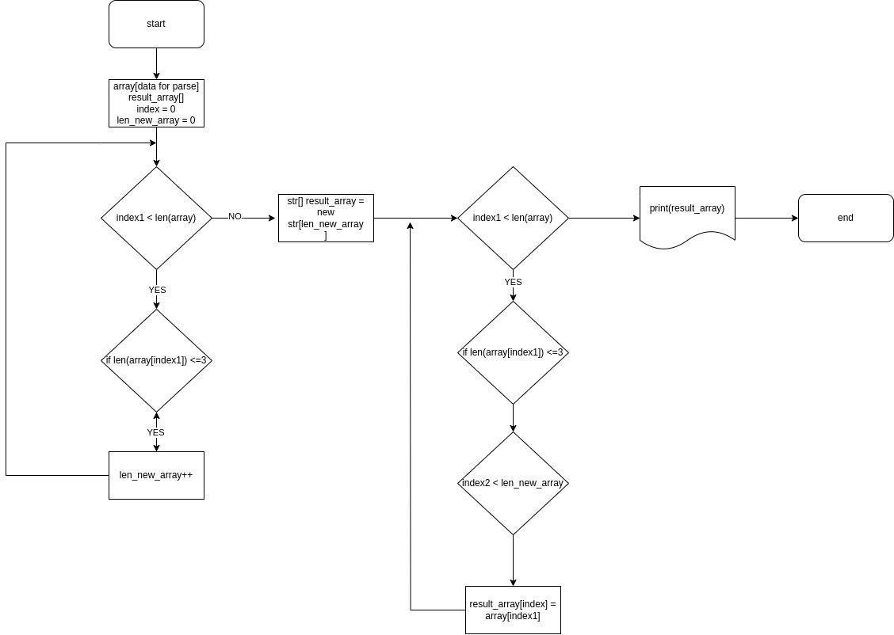

# Контрольная работа по основному блоку

- *В данном задании будет реализован алгоритм работы создания нового массива данных после на основе обработки данного массива* -
Для работы алгоритма, исходники требуется собрать использую dotnet.
